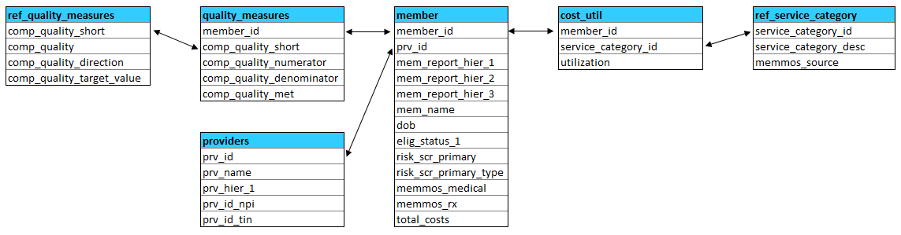

# Requirements Document

## Introduction
Our clients are looking for a way to easily look up their providers and see how they are doing relative to one another, specifically in terms of utilization, PMPM, and quality measures. They want to be able to easily pull up a provider and see how they are doing compared to their practice and ACO.

### Purpose
The purpose of this dashboard/scorecard is to allow a physicians manager to quickly and easily see how their providers are doing with respect to utilization, PMPM, and quality measures. We would like the manager to be able to choose specific providers and be able to export details pertaining to their performance.

### Background
The reasoning behind developing this dashboard is that clients have been asking for a way to easily figure out how their providers are doing with respect to utilization, PMPM, and quality measures.

### References
Interviewed consultants within the PRM office to see what their clients were asking for.

### Assumptions
 * Milliman PRM Analytics will provide hosting for the tool
 * The tool will follow this data schema:

 \

 * Quality measure targets are accurate to the clients goals

### Constraints
Quality measures will differ for each client. There isn't an easy way to display the various types of quality measures.

### Acronyms & Terms
 * **ACO** -  Accountable Care Organization
 * **DOB** - Date of Birth
 * **ER** - Emergency Room
 * **IP** - Inpatient
 * **NPI** - National Provider Identifier
 * **OP** - Outpatient
 * **PMPM** - Per Member per Month
 * **QMs** - Quality measures
 * **SNF** - Skilled Nursing Facility
 * **TIN** - Taxpayer Identification Numbers

### Roles & Responsibilities
Name | Contact Information | Role | Responsibilities
:---| :---| :--- | :---
Michael Reisz | michael.reisz@milliman.com | Development Coordinator | Coordinate UI development, Provide initial UI mock-up, Define data model
Kelsie Stevenson | kelsie.stevenson@milliman.com | Developer | Work on initial UI mock-up, Help define data model

## Requirements
This project requires...

### User Requirements
User must be able to:
 * See all of the providers
 * Search for provider by
	 * Provider name
	 * TIN
	 * NPI
 * Select a single provider
 * See utilization/1000 for a single provider
	 * ER
	 * IP
	 * SNF
	 * Home health
	 * Hospice
	 * Office
	 * Pharmacy
 * See PMPM for a single provider
	 * ER
	 * IP
	 * SNF
	 * Home health
	 * Hospice
	 * Office
	 * Pharmacy
      * Total
 * Risk Adjusted PMPM
 * Average PMPM at the population level
 * Risk scores for a single provider
 * Quality measures at the provider level
 * Print/send to excel
	 * Provider list
	 * Utilization
	 * PMPM
	 * Quality measures

### Functional Requirements
None.

### Architecture/Design Requirements
 * Ability to see utilization, PMPM, and quality measures at the provider level
 * Compare quality measures to the target
 * Source of data will be from the PUAD and PUDD from the Analytics Pipeline

### Performance Requirements
None.

### Security Requirements
 * The report needs to be reducible.

### Other Requirements
None.

### Project Life-cycle/Update Requirements
 * Life-cycle - monthly updates.
 * Update as needed with version releases.
